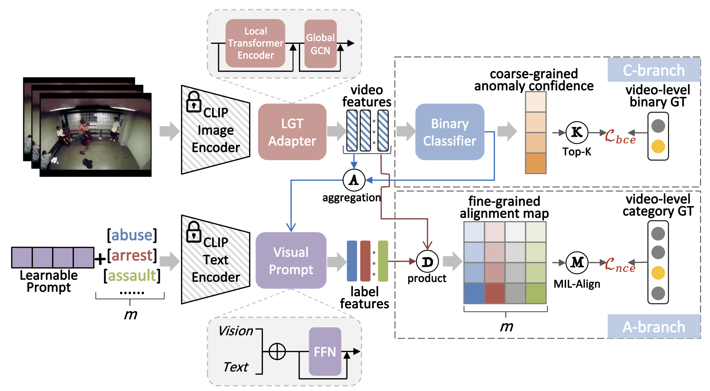

# VadCLIP
This is the official Pytorch implementation of our paper:
**"VadCLIP: Adapting Vision-Language Models for Weakly Supervised Video Anomaly Detection"** in **AAAI 2024.**  
> <a href="https://scholar.google.com.hk/citations?user=QkNqUH4AAAAJ" target="_blank">Peng Wu</a>, <a href="https://scholar.google.com/citations?user=ljzQLv4AAAAJ" target="_blank">Xuerong Zhou</a>, <a href="https://scholar.google.com.hk/citations?hl=zh-CN&user=1ZO7pHkAAAAJ" target="_blank">Guansong Pang</a>, <a href="https://paperswithcode.com/search?q=author%3ALingru+Zhou" target="_blank">Lingru Zhou</a>,  <a href="https://scholar.google.com/citations?user=BSGy3foAAAAJ" target="_blank">Qingsen Yan</a>, <a href="https://scholar.google.com.au/citations?user=aPLp7pAAAAAJ" target="_blank">Peng Wang</a>, <a href="https://teacher.nwpu.edu.cn/m/en/1999000059.html" target="_blank">Yanning Zhang</a>



## Highlight
- We present a novel diagram, i.e., VadCLIP, which involves dual branch to detect video anomaly in visual classification and language-visual alignment manners, respectively. With the benefit of dual branch, VadCLIP achieves both coarse-grained and fine-grained WSVAD. To our knowledge, **VadCLIP is the first work to efficiently transfer pre-trained language-visual knowledge to WSVAD**.

- We propose three non-vital components to address new challenges led by the new diagram. LGT-Adapter is used to capture temporal dependencies from different perspectives; Two prompt mechanisms are devised to effectively adapt the frozen pre-trained model to WSVAD task; MIL-Align realizes the optimization of alignment paradigm under weak supervision, so as to preserve the pre-trained knowledge as much as possible.

- We show that strength and effectiveness of VadCLIP on two large-scale popular benchmarks, and VadCLIP achieves state-of-the-art performance, e.g., it gets unprecedented results of 84.51\% AP and 88.02\% on XD-Violence and UCF-Crime respectively, surpassing current classification based methods by a large margin.

## Training

### Setup
We extract CLIP features for UCF-Crime and XD-Violence datasets, and release these features and pretrained models as follows:

| Benchmark | CLIP[Baidu]    | CLIP | Model[Baidu]  | Model | 
|--------|----------|-----------|-------------|------------|
| UCF-Crime   | [Code: 7yzp](https://pan.baidu.com/s/1OKRIxoLcxt-7RYxWpylgLQ) | [OneDrive](https://stuxidianeducn-my.sharepoint.com/:u:/g/personal/pengwu_stu_xidian_edu_cn/Ea86YOcp5z9KhRFDQm9a8zwBcGiGGg5BuBJtgmCVByazBQ?e=tqHLHt)     | [Code: kq5u](https://pan.baidu.com/s/1_9bTC99FklrZRnkmYMuJQw)         | [OneDrive](https://stuxidianeducn-my.sharepoint.com/:u:/g/personal/pengwu_stu_xidian_edu_cn/Eaz6sn40RmlFmjELcNHW1IkBV7C0U5OrOaHcuLFzH2S0-Q?e=x8wtVe)           | 
| XD-Violence | [Code: v8tw](https://pan.baidu.com/s/1q8DiYHcPJtrBQiiJMI7aJw)| [OneDrive](https://stuxidianeducn-my.sharepoint.com/:f:/g/personal/pengwu_stu_xidian_edu_cn/Et5dWQZb2cBDs7zsrp90SrQBL_52vTRNYTdjQW6SMl0ZVA?e=foX4ph)      | [Code: apw6](https://pan.baidu.com/s/1O0uwVS3ZyDA1soWUv2VasQ) | [OneDrive](https://stuxidianeducn-my.sharepoint.com/:u:/g/personal/pengwu_stu_xidian_edu_cn/EYlNnn_xfVxBtQZuQgngrMsBHY-i8QHTVOs7PmryzQ2MyA?e=99nxnR)           | 


The following files need to be adapted in order to run the code on your own machine:
- Change the file paths to the download datasets above in `list/xd_CLIP_rgb.csv` and `list/xd_CLIP_rgbtest.csv`. 
- Feel free to change the hyperparameters in `xd_option.py`
### Train and Test
After the setup, simply run the following command: 


Traing and infer for XD-Violence dataset
```
python xd_train.py
python xd_test.py
```
Traing and infer for UCF-Crime dataset
```
python ucf_train.py
python ucf_test.py
```

## References
We referenced the repos below for the code.
* [XDVioDet](https://github.com/Roc-Ng/XDVioDet)
* [DeepMIL](https://github.com/Roc-Ng/DeepMIL)

## Citation

If you find this repo useful for your research, please consider citing our paper:

```bibtex
@article{wu2023vadclip,
  title={Vadclip: Adapting vision-language models for weakly supervised video anomaly detection},
  author={Wu, Peng and Zhou, Xuerong and Pang, Guansong and Zhou, Lingru and Yan, Qingsen and Wang, Peng and Zhang, Yanning},
  booktitle={Proceedings of the AAAI Conference on Artificial Intelligence (AAAI)},
  year={2024}
}

@article{wu2023open,
  title={Open-Vocabulary Video Anomaly Detection},
  author={Wu, Peng and Zhou, Xuerong and Pang, Guansong and Sun, Yujia and Liu, Jing and Wang, Peng and Zhang, Yanning},
  journal={arXiv preprint arXiv:2311.07042},
  year={2023}
}

```
---
